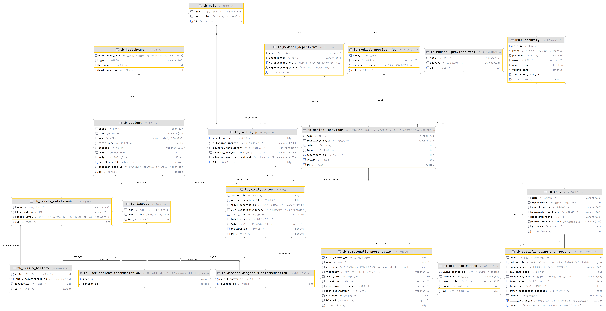
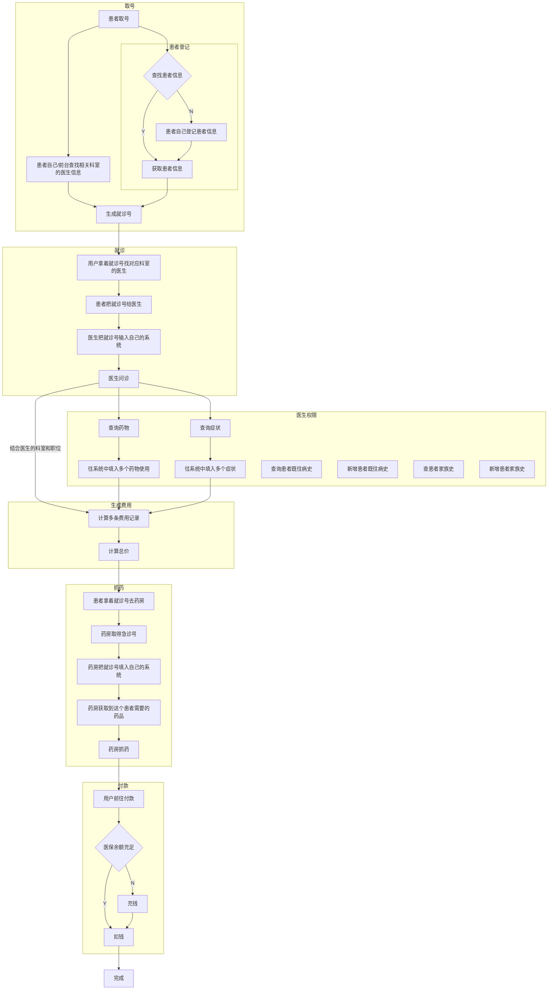

# README

## Relation-ship

### 关系与字段

-   一次会诊(entity)
    -   就诊号(id)
    -   就诊时间
    -   对应一个其他辅助治疗(TEXT)
    -   联系人是啥意思?
    -
    -   对应一个患者(reference)
    -   对应一个医疗服务者(reference)
    -   对应一个随访信息(reference)
    -   ~~对应一个实验室检查(reference)~~
    -
    -   对应多个症状及体征(reference)
    -   对应多个可能的疾病(reference)
    -   对应多个用药(reference)
    -   对应多个费用(reference)
-   一个患者(entity)
    -   姓名
    -   性别
    -   出生日期
    -   家庭住址
    -   身高(m)
    -   体重(kg)
    -   出生体重(kg)
    -   对应一个医保情况(reference)
    -   对应多个家族史(reference)
    -   对应多个既往用药史(用药relation-ship)
-   医保情况(entity)
    -   医保号(id)
    -   医保类型(char)
-   随访信息(entity)
    -   过敏症状改善情况(char)
    -   身体发育情况(char)
    -   药物不良反应(char)
    -   不良反应处理方法(TEXT)
-   一个医疗服务者(entity)
    -   id
    -   名称
    -   职称Enum
    -   对应一个医疗服务机构(reference)
-   一个医疗服务机构(entity)
    -   id
    -   名称
    -   地址
-   费用(entity)
    -   id
    -   一个费用类别enum
    -   一个费用金额
    -   一个其他描述
-   家族史(RelationShip)
    -   id
    -   患者名(reference)
    -   一级/二级(与家族中的关系存在函数依赖)
    -   家族中的关系enum
    -   疾病reference
-   一个用药(RelationShip)
    -   id
    -   对应一个药品(reference)
    -   一次药物使用计量(char)
    -   使用天数
    -   使用频率
    -   治疗开始时间
    -   治疗结束时间
    -   特定用药指导(TEXT)
-   疾病诊断(relation-ship)
    -   id
    -   疾病reference
    -   严重程度(char)
    -   诊断时间
-   药品(entity)
    -   id
    -   名称(CHAR)
    -   规格(CHAR)
    -   给药途径(CHAR)
    -   给药部位(CHAR)
    -   用药注意事项(TEXT)
    -   用药指导(TEXT)
-   疾病(entity)
    -   id
    -   名称(模糊查询)
    -   描述(Text)
-   症状(Relation-ship)
    -   会诊id
    -   id
    -   描述
    -   严重程度
    -   频率
    -   症状开始时间
    -   诱因
    -   环境因素
    -   体征描述

### ER图


```mermaid_
graph TD

会诊-->会诊id((就诊号))
会诊-->会诊time((就诊时间))
会诊-->会诊other((其他辅助治疗))
会诊-->|n|relation-ship11{就诊}-->|1|患者
会诊-->|n|relation-ship12{进行诊断}-->|1|医疗服务者
会诊-->|n|relation-ship13{疾病诊断}-->|m|疾病
会诊-->|1|relation-ship14{用药}-->|m|特定药品使用方式
会诊-->|1|relation-ship15{产生}-->|m|费用
会诊-->|1|relation-ship16{表现}-->|m|症状
会诊-->|1|relation-ship17{随访}-->|1|随访信息


relation-ship13{疾病诊断}-->疾病诊断id((id))
relation-ship13{疾病诊断}-->疾病严重程度((严重程度))
relation-ship13{疾病诊断}-->疾病诊断时间((诊断时间))


特定药品使用方式-->用药id((id))
特定药品使用方式-->用药使用计量((使用计量))
特定药品使用方式-->用药使用天数((使用天数))
特定药品使用方式-->用药使用频率((使用频率))
特定药品使用方式-->用药治疗开始时间((治疗开始时间))
特定药品使用方式-->用药治疗结束时间((治疗结束时间))
特定药品使用方式-->用药其他用药指导((其他用药指导))
特定药品使用方式-->|n|relation-ship21{使用}-->|1|药品

患者-->患者id((id))
患者-->患者电话((电话))
患者-->患者sex((性别))
患者-->患者birth((出生日期))
患者-->患者address((家庭住址))
患者-->患者height((身高))
患者-->患者weight((体重))
患者-->|1|relation-ship31{持有}-->|1|医保
患者-->|1|relation-ship32{有}-->|m|家族史
患者-->|1|relation-ship33{既往用药史}-->|m|特定药品使用方式

医保-->医保号((医保号))
医保-->医保类型((类型))

家族史-->家族史记录id((id))
家族史-->家族关系((家族成员关系))
家族史-->|1|relation-ship41{患有}-->|m|疾病


药品-->药品id((id))
药品-->药品名称((名称))
药品-->药品规格((规格))
药品-->药品途径((给药途径))
药品-->药品部位((用药部位))
药品-->药品注意事项((用药注意事项))
药品-->药品指导((用药指导))


疾病-->疾病id((id))
疾病-->疾病名称((名称))
疾病-->疾病描述((描述))

症状-->症状id((id))
症状-->症状描述((描述))
症状-->症状名称((名称))
症状-->症状严重程度((严重程度))
症状-->症状频率((频率))
症状-->症状开始时间((开始时间))
症状-->症状诱因((诱因))
症状-->症状环境因素((环境因素))
症状-->症状体征描述((体征描述))

随访信息-->随访_过敏症改善((过敏症改善情况))
随访信息-->随访_身体发育((身体发育情况))
随访信息-->随访_药物不良((药物不良反应))
随访信息-->随访_不良反应处理方法((不良反应处理方法))


医疗服务者-->医疗服务者id((id))
医疗服务者-->医疗服务者名称((名称))
医疗服务者-->医疗服务者职称((职称))
医疗服务者-->|n|relation-ship51{从属}-->|1|医疗服务机构


医疗服务机构-->医疗服务机构id((id))
医疗服务机构-->医疗服务机构名称((名称))
医疗服务机构-->医疗服务机构地址((地址))


费用-->费用id((id))
费用-->费用类别((类别))
费用-->费用金额((金额))
费用-->费用描述((描述))
```

### Entity

-   就诊表
    -   就诊号(long)
    -   就诊时间(datatime)
    -   其他辅助治疗(TEXT)
    -   患者表id
    -   医疗服务者表id
    -   随访表id
-   疾病诊断中间表
    -   就诊号/就诊表id
    -   疾病表id
-   疾病表
    -   id(int)
    -   名称(varchar(63))
    -   描述(TEXT)
-   特定药品使用方式中间表
    -   就诊号/就诊表id
    -   患者表id(冗余, 为了提高效率)
    -   药品表id
    -   使用计量(varchar(63))
    -   使用天数(int)
    -   使用频率(varchar(63))
    -   治疗开始时间(date)
    -   治疗结束时间(date)
    -   其他用药指导(TEXT)
-   药品表
    -   id
    -   名称(str)
    -   规格(str)
    -   给药途径(varchar(63))
    -   用药部位(varchar(63))
    -   用药注意事项(varchar(255))
    -   用药指导(varchar(255))
-   费用产生表
    -   就诊号/就诊表id
    -   费用表id
    -   类别(varchar(63))
    -   金额(float)
    -   描述(varchar(255))
-   症状表现表
    -   就诊号/就诊表id
    -   症状id
    -   名称(varchar(63))
    -   严重程度(enum-轻度/中度/重度)
    -   频率(varchar(63))
    -   开始时间(date)
    -   诱因(varchar(63))
    -   环境因素(varchar(63))
    -   体征描述(varchar(63))
    -   描述(TEXT)
-   随访表
    -   id
    -   过敏症改善情况(varchar(255))
    -   身体发育情况(varchar(255))
    -   药物不良反应(varchar(255))
    -   不良反应处理方法(varchar(255))
-   医疗服务者表
    -   id
    -   电话号码(unique, char(11))
    -   名称(varchar(63))
    -   职称(enum-普通/主管/药物)
    -   医疗服务机构表id
-   医疗服务机构表
    -   id
    -   名称(varchar(63))
    -   地址(varchar(255))
-   患者表(既往用药史查询特定药品使用方式中间表)
    -   id
    -   电话(unique, char(11))
    -   性别(enum-male/female)
    -   出生日期(date)
    -   家庭住址(varchar(255))
    -   身高(m) (float)
    -   体重(kg) (float)
    -   医保表id
- 医保表
  - 医保号/医保id
  - 医保类型
-   家族病史(由于患者家属的就诊记录不一定在本数据库中, 故不能直接使用患者家属的患者id)
    -   患者本人在患者表中id
    -   家族史记录id
    -   家族成员关系enum(有很多), 该属性冗余, 不属于BCFC, 但为了提高效率
    -   疾病表id


### 工作流

1.   设计ER图
2.   设计类型
3.   建entity类
4.   建表, 建索引
5.   外键关联

### 建表

[建表语句](src/main/resources/build_table.sql)


## Role

-   INSERT操作只有医生能进行
-   查询操作都能进行
-   与人有关的, 都需要一个phone字段,
    -   因为一个人在数据库中(或许作为医生, 或许作为患者), 但不一定会是这个系统的使用者
    -   所以并不是强关联的

##流程

### 注册流程

#### 患者注册

依据电话号码注册

依据电话号码登录

#### 医生注册

医生不可自己注册

只有让主管医生注册你, 你才可以登录

医生具有患者的一切权限

依据电话号码登录


#### 主管医生注册

主管医生可以增加/提拔某医生为主管医生

主管医生可以新增某医生

### 就诊流程



## 接口抽象

>   区分用户和患者, 用户可以持有多个患者, 患者可以被多个用户持有

### 用户

-   依据电话号码查询用户
-   依据修改用户信息
-   登录
-   注册
-   依据id查询用户

### 患者与医保

-   新增患者信息
-   我们认为, 一个用户可以登记多个患者
-   更改自己的信息/医保号不能修改
-   给医保充值
-   患者具有查询自己和查询医生信息的权限
-   患者没有其他权限


### 医疗服务者和医疗服务机构

-   更新自己的信息
    -   不能更新自己的职位
-   不能查询其他医生的信息
-   可以查询系统中的其他信息


### 主管医生

-   依据医生id查询医生
-   依据医生名字查询医生
-   依据id更新医生职位
-   主管医生总是具有普通医生和药物医生的权限


### 就诊信息

-   患者能依据自己的id查到有关自己的历史就诊信息
    -   依据时间由近期到过去排序
    -   能依据时间范围查询
-   医生能依据自己的id查到有关自己的历史就诊信息
    -   依据时间由近期到过去排序
    -   能依据时间范围查询
-   医生能依据当前患者的id查询到当前患者的有关历史就诊信息
    -   给出当前就诊id
    -   当前用户是否是病人, 直接拒绝, 请求不合适
    -   当前用户是否是主管医生/开发者/数据库管理员, 是, 直接放行
    -   当前用户是否是普通医生, 是, 校验当前就诊提供者id和当前用户的id是否匹配, 是, 放行
    -   拒绝放行, 权限不对
-   用户在JWT中携带的信息, 依次判断其ROLE, 然后进行
-   主管医生能查询到所有就诊信息, 也能依据任何医生的id或者任何患者的id查询到自己的就诊记录
    -   依据时间由近期到过去排序
    -   能依据时间范围查询
-   药物医生能依据具体就诊号查询到需要的具体用药信息, 其余查不到
-   是否能更改就诊信息
    -   有些字段能改, 有些字段不能吧?
    -   那不是会很麻烦...因为


### 计算费用

-   依据已经存在的问诊号, 生成费用记录
    -   药品费用 药品单价* 药品数量
    -   问诊费用 科室问诊价格+医生职位价格
    -   ....
    -   删除在费用表中, 用这个问诊号生成的旧的费用记录
    -   计算总费用
-   依据问诊单查询总费用
    -   如果还没有生成, 就生成一下


更新就诊信息和生成多条费用单和计算费用价格和插入多条具体药物使用和插入多个症状的一系列操作具有原子性


### 付款

-   依据患者号, 获取医保号
-   从医保扣钱
-   从医保加钱


### 既往用药史

查看药物具体使用表


### 药物具体使用

-   新增药物具体使用
    -   普通医生才有权限
-   依据id更新药物具体使用
    -   普通医生才有权限
-   依据id删除药物具体使用
    -   普通医生才有权限
-   以下是查询既往用药史
    -   依据患者id查询
    -   依据患者id和药品名查询
-   依据就诊号查询
    -   药师查询药物
-   依据就诊号和药物名查询
-   症状和疾病, 药物具体使用和药物 逻辑相似


### 药物

-   新增药物
    -   药物医生才有权限
-   依据id删除药物
    -   药物医生只能将"缺货"字段改成"是"
-   依据id更新药物
    -   药物医生才有权限
-   依据药物名模糊查询药物
-   依据药物id查询药物


### 症状


-   新增多个症状, 同一个就诊号
    -   普通医生才有权限
-   依据id更新症状
    -   普通医生才有权限
-   依据id删除症状
    -   普通医生才有权限
-   依据就诊号查询


###疾病

-   新增疾病
    -   主管医生才有权限
-   依据id删除疾病
    -   主管医生才有权限
-   依据id更新疾病
    -   主管医生才有权限
-   依据疾病名模糊查询疾病
-   依据疾病id查询疾病

### 家族史

-   依据患者id查询家族史
-   依据患者id+患者家属关系enum查询家族史
-   依据患者id+疾病id查询家族史
-   新增家族史
-   依据id更新家族史
-   依据id删除家族史


##业务逻辑

### 药品使用

>   医生查询+插入药品使用的逻辑

1.   医生往文本框里输入药品名称

2.   医生按下搜索

3.   客户端把文本框里的内容发送给服务端

4.   服务端把药品名称匹配的药品具体信息统统返回给客户端

     -   其中药品的具体信息中有一个药品ID

         这个是系统内部的数据, 没有实际意义, 只有在数据库内才有意义

         不需要显示给医生

5.   客户端把药品展现给医生

6.   医生从药品中选择一个药品

7.   客户端把这个药品的id暂存下来

8.   医生依据病人的具体情况填写药物的具体使用

9.   客户端把药品的id, 和具体使用方法存入一个列表

10.   医生如果还要继续开药, 就返回1, 否则进入11

11.   医生按下"完成"按钮(这个完成, 可以是单独的开药完成, 也可以是就诊整个过程完成, 客户端自行判断),

12.   客户端将上面的具体用药列表发送给服务端

13.   服务端将具体用药存入数据库


-   依据药品名模糊查询药品
-   将具体用药方法插入用药表
